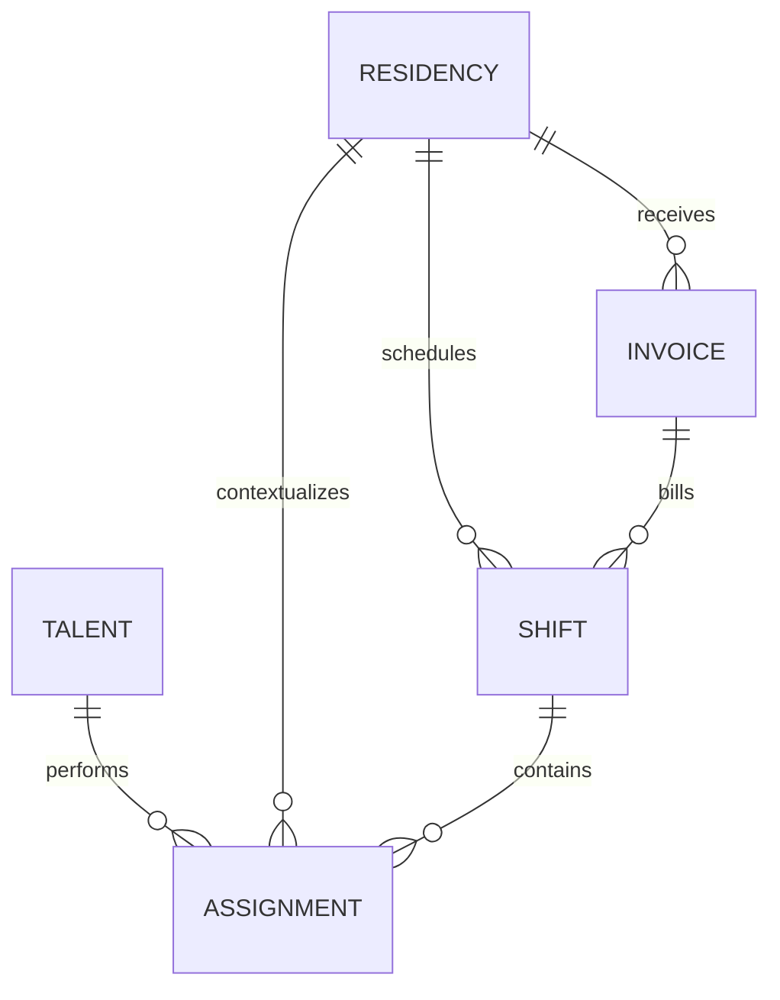

# HFY OS — Independent Standalone Platform Plan

> **Pilot scope update (August 21, 2026):** This strategy document predates the final clean-client rollout decision. For the active pilot boundary, use [`docs/PILOT_SCOPE.md`](docs/PILOT_SCOPE.md): Ace remains untouched in Airtable, new hotels start clean in HFY OS, the narrow hotel selection portal is included, and Ace migration happens only after one or preferably two clean billing cycles. Any migration or client-access sequence below that conflicts with that boundary is superseded.

**Prepared:** August 20, 2026  
**Status:** Revised for an urgent three-residency launch; recommended direction, not a final implementation specification  
**Scope:** Deliver one operator-facing, multi-residency HFY OS with current automation outcomes first; harden the platform and add Rundown/client access afterward

## Executive recommendation

HFY OS should become one standalone, internal operations application where Aus can switch among Ace and new residencies from a single dashboard. Phase 1 should use **Next.js and TypeScript on Vercel**, **Supabase Postgres/Auth/private Storage**, **Drizzle** migrations, **Vercel Cron**, and **Resend**. That is enough to preserve the current workflows and four automation outcomes without making six vendor relationships or an event-driven reliability platform prerequisites for onboarding the next properties.

The migration should preserve the current operating outcomes, not reproduce Airtable field-for-field. The minimum production model still needs Client Accounts separate from Residencies, shared Talent, Shifts, Assignments, Invoices, invoice line items, immutable money/rate snapshots, private files, and a small audit/automation-exception trail. Those are inexpensive safeguards against recreating Ace-specific assumptions for every new hotel. Full agreement versioning, payout batches, status-event tables, a transactional outbox, and a general job platform are target-state improvements, not Phase 1 launch requirements.

Build and cut over the internal system before adding Rundown or client access. Run a read-only shadow comparison against Airtable, but never operate both systems as writable sources of truth. At cutover, freeze Airtable, import the final delta, reconcile, and retain the base as a read-only archive.

The reason to move now is operational multiplication. HFY OS must support at least three residencies without copying a base, formulas, and automations for each one. Financial correctness and sensitive-data protection remain non-negotiable, but the first release should optimize for one operator, one shared system, configurable residency rules, and visible automation exceptions.

## 1. Evidence reviewed and confidence limits

This plan was formed independently from six evidence sources:

1. The live **HFY OS** Airtable base, read on August 20, 2026: table schemas, formulas, select values, links, interfaces, dashboards, form metadata, and records.
2. `HFY_OS_Airtable_Schema_Export.md`, including the four deployed automation definitions.
3. `HFY_Pricing_Framework_v7.md`, including the exact pricing values and unresolved business decisions.
4. `rundown.html`, reviewed as source code rather than only through its description.
5. The sanitized `Guest_List_App_Review/` source and roadmap, used only as an architectural comparison.
6. `HFY_OS_Standalone_Platform_Plan_v2.md`, read after forming the main current-state findings and treated as another opinion to test.

### Verification boundary

The live Airtable connector exposed schema, formula definitions, records, interfaces, dashboards, and form metadata. It did not expose Airtable's automation editor. Direct browser inspection of that editor was blocked by an Airtable sign-in screen. Therefore:

- Schema, formula, record, interface, and record-result observations below were verified directly against the live base.
- The four automation definitions were verified against the same-day schema export and checked for consistency with live record outcomes.
- Automation configuration details that cannot be inferred from records—especially the email action—were not independently opened in Airtable's automation editor.

No Airtable data or configuration was changed during this review.

## 2. What HFY OS is today

HFY OS is an internal programming, scheduling, talent-payment, client-billing, and financial reporting system operated directly inside Airtable. It is not currently a standalone app and does not have its own identity, authorization, or client portal.

### Live footprint

| Table | Live records | Operational purpose |
|---|---:|---|
| Talent | 44 | Roster, booking fit, onboarding documents, payout instructions, earnings summaries |
| Assignments | 154 | One person or guest role booked into a shift; source of booking and payout status |
| Residencies | 1 | Current client/program configuration and financial defaults |
| Shifts | 152 | One room/date/time operating unit; groups assignments and feeds billing |
| Invoices | 24 | Billing periods, approved totals, balances, margin reporting, and PDF placeholder |

The single live residency is Ace Hotel Palm Springs. Its current configuration is a recurring-weekend, weekly-invoice program with Net 7 terms, an `$80` default talent rate, and a `$100` client hourly rate.

### Intended relationship model



In the intended business model, an Assignment belongs to exactly one Shift, a Shift belongs to exactly one Residency, and a Shift belongs to at most one active Invoice. Airtable implements all of those as multi-record links, so formulas must detect missing or multiple parents. The new system should enforce these cardinalities directly.

### How the work is actually surfaced

The live base has two interfaces and one onboarding form:

- **HFY OS v3:** Payouts, Artist Lookup, DJ Earnings, Talent, and Calendar.
- **HFY Finance v3:** Outstanding Receivables, Needs Review, and Revenue & Margin.
- **Artist onboarding:** a standalone form writing to Talent.

These surfaces reveal the real product boundary better than the table list alone. The replacement must reproduce the work queues and decisions Aus uses—not merely offer generic create/read/update/delete screens.

### Current operating flow

1. Shifts are created for a residency, date, room, and start/end time.
2. Each performer or production person is represented by an Assignment linked to a Shift.
3. Booking Status advances through Open, Offered, Confirmed, Cancelled, or Completed.
4. Compensation is hourly, fixed fee, or not applicable. Current hourly compensation is calculated from hours multiplied by an effective rate.
5. A completed, compensated assignment with a talent link, date, and positive amount becomes payment-eligible.
6. Eligible assignments enter the Ready to Pay queue, are paid manually, and then carry a Paid status and Paid Date.
7. Shifts calculate client billable hours and amount, and are grouped into invoices by residency and billing period.
8. Invoices compare a manually approved total with the sum calculated from linked shifts, track due and paid dates, and feed receivables and margin dashboards.

### Live findings that matter to migration

- All **127 payment-eligible assignments** currently have either Ready to Pay or Paid status. There are no eligible records with a missing payout status. This is consistent with the auto-ready automation doing its job.
- There are **zero past-dated Confirmed assignments** as of August 20, 2026. Past records are Completed and future records are Confirmed, consistent with the daily auto-complete outcome.
- **149 of 154 assignments** pass the Shift Link Audit. Five have incomplete schedule data and no shift link.
- The Payout Audit reports **16 Paid assignments without a Paid Date**. These are real migration exceptions that should be resolved or explicitly grandfathered.
- **148 of 152 shifts** are linked to an invoice. The four exceptions are historical and include inconsistent combinations such as an Invoiced status without an invoice link.
- **61 shifts have a blank Billing Status**, and 48 have no assignments. Some empty shifts are valid future schedule containers; blank workflow state should still become an explicit value in the new system.
- All 24 invoices currently pass Airtable's Invoice Audit, but seven Paid invoices have no Sent Date. The existing audit formula only flags a missing Sent Date while status is exactly Sent, so a later Paid transition hides that gap.
- One invoice has a nonzero approved-versus-calculated variance. That may be a legitimate manual adjustment, but the new system should represent it as an invoice adjustment line rather than an unexplained overwritten total.
- No live invoice currently has a generated PDF attached. The invoice auto-send automation therefore cannot be demonstrated from current records, and its Ace exclusion means the only current residency is deliberately outside the automatic-send path.
- `Roster Status` is blank across all 44 Talent records even though `Talent Status` is actively used. The migration should not carry two overlapping lifecycle fields without a defined distinction.

### Airtable formulas: business rules versus scaffolding

Business outcomes worth preserving include:

- Hourly or fixed compensation calculation.
- The payment-eligibility gate.
- Outstanding payout totals.
- Invoice due dates, balances, approved-versus-calculated variance, gross margin, and margin percentage.
- Human-readable schedule and payout summaries.

Airtable scaffolding that should not be ported as fields includes:

- Shift Match Key.
- Shift Link Audit.
- Payout Audit and Invoice Audit as display formulas.
- Date Epoch and billing-period Epoch helpers.
- Month labels that exist only to group charts.

Those outcomes belong in foreign keys, constraints, validated state transitions, queries, and audit views.

### A critical rate inconsistency

The live `Effective Hourly Rate` formula is:

```text
IF(Rate Override is blank, 80, Rate Override)
```

It does **not** read `Residencies.Default Artist Hourly Rate`, despite the field description and schema narrative implying that it does. This works only because the base currently has one residency at `$80`. The replacement must resolve rates through an effective-dated agreement and copy the selected rate onto each Assignment as an immutable snapshot.

Similarly, invoice formulas currently hardcode `$700` per Pool session and `$300` per Amigo session. Those are the current seven-hour and three-hour values at `$100/hour`, not universal room prices. They must become configured or calculated invoice lines, never code constants.

## 3. How the Pricing Framework changes the target model

The Pricing Framework describes two independent revenue streams that the current Airtable model does not cleanly separate:

1. **Program service fee:** the retainer for operating or directing the program.
2. **Talent billing spread:** the amount billed for talent minus HFY's actual talent cost.

The tier boundary is creative authority, not operational involvement:

- **Operations Only:** the client makes the creative decision; HFY executes negotiation, contracting, scheduling, and payment.
- **Complete:** HFY makes and evolves the creative decision as well as executing operations.

HFY remains the financial intermediary for talent in both tiers.

### Exact current framework values

| Rule | Operations Only | Complete |
|---|---:|---:|
| Base per weekly slot, up to 5 hours | $250 | $550 |
| Overage per hour beyond 5 | $50 | $110 |
| Monthly floor | $1,000 | $1,750 |

Additional rules to model:

- A slot is one daypart on one day, up to five hours.
- Structural schedule changes cause a re-quote; gradual hour growth is absorbed by overage math.
- A short trial addition charges one normal slot base for the trial window and is not prorated.
- Talent spread is client-specific and has no approved universal percentage or dollar rule.
- Special events are outside this framework.

### Architecture consequence

Do not encode these numbers in application code. For Phase 1, each Residency has explicit current operating and billing configuration, while every Assignment and invoice line stores the actual rate and amount used as an immutable snapshot. Full effective-dated pricing-policy and agreement-version tables follow in hardening. This keeps the launch model safe for three properties without requiring the unfinished v7 framework to become a pricing engine first.

Invoice line types should include at least:

- Program base fee.
- Overage.
- Trial add-on.
- Talent hours or talent fixed fee.
- Manual adjustment with required reason.
- Special event/custom charge.

The service fee and talent charge must remain visibly separate in calculations even if the client-facing PDF groups or labels them differently.

## 4. What Rundown actually is

`rundown.html` is a polished, single-file Discovery Meeting guide with:

- An eight-stage guided flow.
- Per-question completion state and notes.
- A private internal-evaluation layer.
- Planned-meeting calendar and completed-meeting history screens.
- Custom meeting mode.
- Markdown summary generation, copy, and download.

The source file does **not** use `localStorage`, `sessionStorage`, or IndexedDB. Planned and completed meetings live only in a JavaScript object and disappear on refresh or browser close. Downloaded Markdown is the only durable output. This is more fragile than “local-storage-only” and should be corrected in the planning record.

Rundown's transferable asset is its interaction model, content, and separation between client-safe notes and private evaluation. Its storage and identity layers should be rebuilt. Do not copy the monolithic HTML/CSS/JavaScript file into the initial HFY OS core.

## 5. Lessons from Guest List

Guest List proves several useful HFY product patterns:

- Organization-scoped workspaces.
- Memberships and role-based server checks.
- Explicit event workspaces and task-oriented navigation.
- Append-only audit entries for important operations.
- Idempotent webhook intake and hashed public-link credentials.
- A React-based operations interface that can support multiple simultaneous staff users.

Those ideas should be reused. The Guest List foundation itself should not be copied into HFY OS because it currently uses:

- A beta `vinext` runtime rather than a standard production Next.js deployment.
- Cloudflare D1/SQLite rather than Postgres.
- Runtime `CREATE TABLE IF NOT EXISTS` schema initialization instead of controlled production migrations.
- ChatGPT-host-bound authentication that its own roadmap identifies as a public-launch blocker.
- Application-enforced organization filters without database row-level security.
- Coarse organization memberships for operational staff, another gap already identified in its roadmap.

HFY OS and Guest List should remain separate products. Their domains, release risk, and operating cadence differ. Share design tokens, UI components, validation utilities, and security patterns later through a small package only when both applications have stable implementations. Do not create a shared monorepo or platform abstraction before that need is real.

## 6. Why move off Airtable

### 6.1 Financial correctness needs enforceable rules

Airtable allows links that should be singular to be empty or plural. It allows status and date combinations that the business considers invalid. Formula audits can report a problem after it exists, but they cannot prevent it. Postgres can enforce parent relationships, uniqueness, non-overlapping invoice periods, required values by state, and transactional updates.

### 6.2 Historical money must not recalculate accidentally

Rates, pricing tiers, client terms, and talent costs change. Financial records need immutable snapshots and explicit adjustments. A formula that follows today's default is not a ledger. Invoice line items and payout items should preserve what was approved at the time.

### 6.3 Sensitive payout data is too broadly exposed

The Talent table stores W-9 files, ACH routing/account numbers, Zelle details, and a formula that assembles full payment instructions. The live Payouts interface surfaces those instructions alongside queue items. The new system needs least-privilege access, short-lived file URLs, reveal auditing, MFA for privileged users, and preferably a payment provider that keeps bank details out of HFY OS entirely.

### 6.4 Automation is opaque and weakly observable

Current automations have no application-level job history, idempotency ledger, retry dashboard, or domain event trail. Invoice sending is particularly risky: “send once” should be enforced by a unique delivery record and provider idempotency key, not inferred from a status field.

### 6.5 The product boundary has moved beyond an internal base

Rundown persistence, assessment records, client invitations, tier-specific calendar access, and controlled client actions need a real identity and authorization model. Airtable Interfaces can present selected data, but they are not the right foundation for a purpose-built multi-party application.

### 6.6 The current model is already overfit to one residency

The `$80` compensation default, `$700` Pool line, `$300` Amigo line, and Ace-specific email exception are examples. A second residency with different rooms, rates, cadence, or ownership would force more formulas and branches. That is the right moment to move configuration into explicit agreement records.

## 7. Design principles and non-negotiable invariants

1. **One source of truth at a time.** No production dual-write between Airtable and the new app.
2. **Money is integer cents.** Never use floating-point currency.
3. **Rates are snapshotted.** Historical assignments and invoice lines never change because a default changes.
4. **One Assignment, one Shift.** Enforced by a non-null foreign key for live records.
5. **One active invoice per Shift.** Enforced by a unique relationship and non-overlapping billing periods.
6. **State changes are commands, not free-form edits.** Every transition validates prerequisites. Phase 1 records material changes in one generic audit log; entity-specific append-only status tables follow in hardening.
7. **Derived values have one implementation.** Put business calculations in a tested domain layer, with database-generated values only where they materially improve integrity.
8. **Every external side effect is idempotent.** Invoice email, imports, and scheduled transitions can be retried safely even before a transactional outbox is introduced.
9. **External clients are denied by default.** Client portal permissions are narrow, residency-scoped, and tested at both server and database layers.
10. **Sensitive access is observable.** Reading or revealing tax/payment documents is logged, not only modifying them.

## 8. Recommended stack and Phase 1 boundary

### Phase 1 launch stack

Phase 1 has three ongoing service relationships:

| Service | Phase 1 responsibility |
|---|---|
| Vercel Pro | Host the Next.js app, preview/production deployments, authenticated cron endpoints, and basic runtime logs. Pro is required for hourly Cron; Hobby permits only daily scheduling. |
| Supabase | Postgres, single-operator authentication, private file storage, database backups, and server-side data access. |
| Resend | Send invoice emails from a verified HFY domain using a unique idempotency key per invoice version. |

GitHub remains the code host, and Airtable remains the read-only migration source/archive; neither is another runtime subsystem. Use Vercel Cron for the two scheduled reconciliation jobs and ordinary database transactions for immediate automation. This is intentionally less durable than the target architecture, but it is sufficient at the initial volume if every job is idempotent, writes a visible result, and has a manual retry.

### Target stack after hardening

The following is the intended end state. Rows marked deferred are not Phase 1 dependencies.

| Layer | Choice | Reasoning |
|---|---|---|
| Application | Next.js App Router, React, TypeScript | Fits HFY's existing React experience; supports server-rendered internal screens, route handlers, and focused interactive client components without a separate API project. |
| Hosting | Vercel | First-class Next.js deployment, preview environments, managed TLS, function hosting, and useful deployment observability. Keep long jobs out of request handlers. |
| Database | Supabase-managed Postgres | Foreign keys, constraints, transactions, range types, reporting SQL, row-level security, managed backups, and a direct path to multi-tenant access. |
| Schema/query layer | Drizzle ORM plus reviewed SQL migrations | Already familiar from Guest List, stays close to SQL, and supports checked-in migration files. Production deploys run migrations; application startup never creates or alters tables. |
| Authentication | Supabase Auth | One identity vendor integrated with Postgres and Storage; supports invitation flows, passwordless options, OAuth, and MFA. HFY organization/membership semantics remain explicit application tables. |
| File storage | Private Supabase Storage buckets | Centralized access policy with Postgres RLS; short-lived signed URLs for W-9s and invoice PDFs; no public financial-document URLs. |
| Background jobs — deferred | Trigger.dev | Add after cutover when durable retries, richer run history, or job volume justify replacing Vercel Cron. |
| PDF generation — deferred | Playwright Chromium inside a Trigger.dev job | Add automated branded generation after launch. Phase 1 preserves the current behavior by accepting an uploaded PDF before approval/send. |
| Transactional email | Resend from a verified HFY domain | Provider idempotency, delivery/bounce webhooks, and a clear delivery record are a better fit than long-lived Gmail OAuth for automated invoices. Set `Reply-To` to the monitored billing inbox. |
| Monitoring — deferred | Sentry plus Vercel/Trigger run telemetry | Add structured exception alerting during hardening; use Vercel logs plus the in-app Attention queue during the launch window. |
| Optional payout rail — deferred | Stripe Connect, evaluated separately | Hosted/embedded onboarding can keep bank and routing details off HFY's server. It changes payout operations and compliance responsibilities, so it is a post-launch decision. |

### Why this combination

The launch stack keeps the interactive app conventional while consolidating database, identity, and file access in Supabase. Immediate state changes stay in short database transactions. Vercel Cron invokes bounded reconciliation handlers; no Phase 1 task should depend on a long-running web request or local filesystem state. Trigger.dev later takes over work that needs durable orchestration.

Supabase Auth is an identity system, not HFY's organization model. Phase 1 is deliberately **multi-residency but not multi-tenant**: one HFY operator workspace contains many client accounts and residencies. External organizations, memberships, residency grants, and the complete tenant RLS matrix arrive with client-facing access. This avoids confusing “one system for many properties” with “many customer organizations can sign in.”

### Security posture

- Require MFA for HFY administrators before production cutover.
- Keep all Phase 1 database access server-side behind an authenticated HFY session; do not expose broad browser database access.
- Use restrictive policies on private Storage objects. Add the complete tenant RLS matrix before external client access.
- Verify authorization in every Server Action and Route Handler; do not rely on hidden buttons.
- Keep the Supabase secret/service key server-only. It bypasses RLS and must never be used in the browser.
- Put W-9s and invoice PDFs in separate private buckets with different policies.
- Do not place full ACH data in logs, audit payloads, search indexes, analytics, or client-side state.
- If full bank details must be migrated temporarily, use field-level encryption with a dedicated server-only key, reveal them only on a privileged screen, and audit every reveal. Move to managed key custody or provider-hosted collection during hardening.
- Maintain one append-only audit log for material financial and workflow changes. Financial corrections create documented adjustment records; they do not erase history.

### Backup posture

Use a paid Supabase plan with daily database backups from the beginning, and retain the frozen Airtable base as the migration-era recovery source. During Phase 2, add an independent scheduled logical export and separate object-storage backup because Supabase database backups contain Storage metadata but do not restore deleted Storage objects. Perform a restore drill before Airtable archive access is retired. Point-in-time recovery can be added when HFY's acceptable data-loss window justifies its cost.

## 9. Phase 1 data model and target expansion

### Minimum Phase 1 schema

Phase 1 should ship only the tables needed to operate several residencies safely:

- `users` and one internal `workspace` for HFY operator access.
- `client_accounts` and `residencies`, kept separate so one hotel group can own several programs. Each Residency stores its current tier, timezone, schedule defaults, payment terms, invoice cadence, current talent/client rates, invoice prefix, billing contacts, and `auto_send_invoices` setting.
- `talent`, `talent_genres`, `talent_onboarding_submissions`, private `talent_documents`, and restricted `talent_payment_profiles`.
- `shifts` and `assignments`, with the Residency relationship enforced and the actual talent/client rate copied onto each financial record.
- `invoices`, `invoice_line_items`, and `invoice_shift_links`. Line items are required in Phase 1 because Operations Only and Complete can combine service fees, talent charges, and explicit adjustments.
- `files`, `invoice_deliveries`, `attention_items`, `automation_runs`, `audit_log`, `airtable_import_map`, and `legacy_exceptions`.

For launch, an Assignment may carry `payout_status`, `paid_at`, `paid_amount`, and a payment reference directly. A separate payout ledger and batch model is better long term, but it is not necessary to preserve the current manual Ready to Pay workflow for one operator. The migration must still reject Paid without a date/amount or explicitly grandfather the 16 known exceptions.

The following sections describe the target expansion after Phase 1. They should shape IDs and relationships now, but their tables do not all need to exist before the next residencies launch.

### Target domain map

This is a domain map, not final column-level SQL.

### Identity and access

- `users`: application profile keyed to `auth.users`.
- `organizations`: HFY and future client organizations.
- `memberships`: user, organization, role, status, invited/accepted/revoked timestamps.
- `access_grants`: optional residency/program-scoped external access.
- `audit_events`: actor, action, entity, before/after summary, request/job correlation ID, timestamp.

### Commercial structure

- `client_accounts`: the commercial customer; separate from a venue or program.
- `residencies`: the continuing venue program. Preserve the familiar name for parity.
- `service_agreements`: client, residency, tier, status, start/end dates.
- `service_agreement_versions`: immutable pricing and terms effective for a date range.
- `program_slots`: daypart + day-of-week definitions used by the slot-pricing framework.
- `pricing_policy_versions`: draft/active Operations Only and Complete defaults, including slot, overage, and floor values.

Separating client accounts from residencies prevents a hotel group with multiple properties or multiple programs from being forced into one row.

### Talent and scheduling

- `talent`: roster identity, status, home market, notes.
- `talent_genres`: normalized many-to-many tags.
- `talent_documents`: private W-9 metadata and storage key.
- `talent_payment_profiles`: provider reference or encrypted fallback data, last four digits, method, verification status; no assembled “payment details” text field.
- `shifts`: residency, room/daypart, start/end timestamp, timezone, billing state, rate snapshot.
- `assignments`: one shift, optional talent, guest display name, role, booking state, compensation type, talent-rate snapshot, calculated compensation.
- `booking_status_events`: append-only transition history.

Use timestamps for assignment start and end. Do not reproduce the Airtable half-hour select lists or `SWITCH` formula. Cross-midnight and future schedule patterns then work naturally.

### Payouts

- `payouts`: payee, method reference, initiated/completed/failed status, timestamps, external reference, total.
- `payout_items`: payout-to-assignment allocation and amount.
- `payout_status_events`: append-only transition history.

An Assignment can be eligible without pretending that eligibility itself is the payment transaction. “Ready to Pay” is a queue state; a Payout is an actual disbursement record.

### Billing

- `invoices`: client/residency, billing period, issue/due dates, lifecycle state, locked version, subtotal/total/balance snapshots.
- `invoice_line_items`: description, type, quantity, unit, unit amount, total, source shift/assignment/agreement version, adjustment reason.
- `invoice_shift_links`: explicit membership where operational traceability is useful.
- `invoice_documents`: generated PDF version, hash, storage key, generated timestamp.
- `invoice_deliveries`: recipient, provider message ID, idempotency key, sent/delivered/bounced timestamps, error.
- `invoice_status_events`: append-only transition history.

“Approved total” should be the sum of locked line items. A manager can add a documented adjustment line; they should not overwrite a calculated number and leave the reason implicit.

### Reliability and migration

- `domain_events` or `outbox_events`: transactional work waiting for a background task.
- `job_runs`: business-readable result of scheduled and event-driven jobs.
- `airtable_import_map`: Airtable record ID, target table and ID, import batch, source hash.
- `legacy_exceptions`: unresolved source inconsistencies with disposition and approver.

## 10. Reimplementing the four automations

### 10.1 Payment eligibility to Ready to Pay

When an Assignment enters Completed, the same database transaction validates:

- compensation type is not N/A;
- a talent/payee exists;
- a performance date and valid duration or fixed fee exist;
- total compensation is positive;
- it is not already Paid.

If valid, set the queue state to Ready to Pay and add an audit entry in the same transaction. Run an idempotent Vercel Cron reconciliation as a safety net, but do not make the scheduled job the primary source of correctness.

### 10.2 Auto-complete past bookings

Use an authenticated Vercel Cron endpoint. Invoke it hourly, exit unless the relevant residency's local time has crossed 6:00 a.m., and track that day's run per residency. This handles daylight saving time without another scheduler. Improve the predicate to use the Shift's actual end timestamp, not only “date is before today.” Record a summary and make reruns idempotent.

### 10.3 Link a Shift to its covering Invoice

On Shift creation or material date/residency change, resolve the unique open invoice period for that residency in the application transaction. The database should prevent overlapping active billing periods. If the result is zero or multiple candidates, create an `attention_item` instead of silently choosing.

Longer term, reverse the workflow: generate an invoice draft from eligible, reviewed Shifts. That is clearer than creating large sets of future invoices and hoping every Shift attaches to the right range. Preserve current auto-link behavior for initial parity, then evaluate the reversal after cutover.

### 10.4 Send an approved Invoice with its PDF

Preserve the actual current automation before improving it:

1. Phase 1 lets Aus upload the final invoice PDF to private Storage and review the locked invoice line items it represents.
2. Approval requires a PDF and checks the Residency's visible `auto_send_invoices` setting.
3. When auto-send is enabled, reserve a unique `invoice_delivery` row, then make a short Resend call using the same invoice-version idempotency key and record the provider result.
4. If sending fails, the invoice remains Approved with a Send Failed attention item. A retry button and scheduled catch-up use the same idempotency key.
5. Invoice lifecycle and delivery outcome remain separate even though full delivery webhooks and status-event tables are deferred.

Replace the hardcoded Ace exception with Residency configuration and a visible reason. Automated PDF generation with Playwright moves to Phase 2 hardening. That is a safe cut because the live automation only sends after a PDF exists, and the live base currently contains no attached invoice PDFs; Phase 1 preserves the demonstrated workflow rather than removing it.

## 11. Product surfaces required for the multi-residency launch

Build task-oriented modules, not five generic table editors:

1. **Global dashboard / Attention:** a persistent Residency switcher plus an All Residencies view. Show today's and upcoming Shifts, open/unassigned work, Ready to Pay totals, invoices needing review, overdue receivables, and automation exceptions by Residency.
2. **Calendar:** one shared calendar filterable by Residency and room, with open/offered/confirmed/completed assignments, quick reassignment, and conflict warnings.
3. **Talent:** roster search, status, genres, market, priority, upcoming work, a replacement Artist onboarding form/review queue, documents, and restricted payout profile.
4. **Payouts:** Ready to Pay queue across all Residencies, grouped payee totals, payment method readiness, manual payment recording, history, and exceptions.
5. **Residencies:** client account, tier, contacts, rooms/dayparts, current rates/terms, scheduling pattern, invoice cadence, and auto-send configuration.
6. **Invoices:** draft construction, line-item review, variance/adjustment explanation, PDF upload/preview, approval, delivery outcome, payment, and receivables.
7. **Reporting:** DJ earnings, revenue, talent cost, gross margin, outstanding payouts, outstanding receivables.
8. **Administration:** operator account, audit log, automation runs, attention items, configuration, and migration exceptions.

The current Interfaces are acceptance references for information hierarchy. They are not pixel-perfect templates.

## 12. Phased build order

The earlier order was too infrastructure-heavy for the current sales timeline. Claude's sequencing criticism is correct. The target architecture is still useful, but it should not be treated as a launch checklist.

### What is cut from Phase 1

| Defer until hardening | Phase 1 substitute |
|---|---|
| Trigger.dev | Short transactional handlers plus authenticated, idempotent Vercel Cron reconciliation jobs. |
| Sentry | Vercel logs plus an in-app Attention queue and `automation_runs`; inspect them daily during launch. |
| Playwright invoice generation | Upload the final PDF, then preserve approval/auto-send behavior. |
| Transactional outbox/domain-event architecture | Perform immediate rules in the same database transaction; use unique keys and a reconciliation cron for recoverability. |
| Entity-specific booking, payout, invoice, and delivery event tables | One append-only `audit_log` for material changes. |
| Full payout/payout-item ledger and batches | Assignment-level Ready to Pay/Paid fields with required amount, date, and reference. |
| Effective-dated agreement and pricing-policy engines | Current Residency configuration plus immutable rate/amount snapshots on Assignments and invoice lines. |
| External organizations, memberships, scoped grants, and full tenant RLS | One authenticated HFY operator workspace; client-facing access remains off. |
| Stripe Connect or another payout provider integration | Preserve the current manual payout process with tighter access to payment details. |
| Resend delivery-webhook lifecycle | Record send success/failure and provider message ID; add bounce/delivery state later. |
| Rundown, Assessment, and client portal | Keep them outside the Airtable-replacement critical path. |

### What must not be cut

- One database and dashboard for all Residencies, with a global view and fast Residency switcher.
- Separate Client Account and Residency records; no base, schema, or deployment per client.
- One shared Talent roster with Residency-specific schedule and rate context.
- Configurable tier, timezone, terms, invoice cadence, current rates, and auto-send behavior per Residency.
- Assignment and invoice-line money snapshots in integer cents; no Ace-specific rates in code or formulas.
- Database-enforced Assignment → Shift and Shift → Residency relationships, plus one active invoice per Shift.
- The Ready to Pay, daily auto-complete, Shift-to-Invoice, and approved-invoice-send outcomes.
- Email idempotency, visible failures, a manual retry, and scheduled reconciliation.
- Private file storage, server-side authorization, MFA for the operator, and restricted payment-data access.
- Staging validation, repeatable Airtable import mapping, control-total reconciliation, a freeze-and-delta cutover, and no production dual-write.

These are the minimum controls that keep speed from becoming three inconsistent versions of HFY OS.

### Phase 0 — Launch specification, measured in days

Deliver:

- Confirm the launch Residency configuration shape: client, tier, timezone, rooms/dayparts, schedule defaults, talent/client rates, payment terms, invoice cadence, contacts, invoice prefix, and auto-send setting.
- Decide how existing bank details and W-9s are handled during migration; a new payout provider is not required.
- Define the valid booking, payout, billing, and invoice transitions needed for parity.
- Classify the five unlinked Assignments, four unlinked Shifts, sixteen missing payout dates, and one invoice variance.
- Turn the four current automation outcomes and the All Residencies dashboard into acceptance tests.

Do not wait for the entire Pricing Framework v7, client permissions model, or hardening architecture to be finalized.

Exit gate: the minimum schema, sensitive-data handling, per-Residency configuration, and parity checklist are signed off.

### Phase 1 — Working multi-residency HFY OS

Build this as four deployable vertical slices, not as a long foundation project.

#### 1A. Operator foundation and multi-residency shell

- Next.js on Vercel; Supabase Postgres/Auth/private Storage; Drizzle migrations; staging and production.
- One HFY operator account with MFA and server-side authorization.
- Client Accounts, Residencies, Talent, basic audit/attention records, and private documents.
- All Residencies dashboard, persistent Residency switcher, and Residency configuration screens.

Exit gate: Ace plus two representative test Residencies coexist in one staging system without copied tables, code, or automations.

#### 1B. Scheduling and talent operations

- Shared Talent roster, Artist onboarding form/review, Calendar, Shifts, Assignments, status transitions, compensation types, conflicts, and missing-data validation.
- Store actual rate snapshots on each Assignment.
- Immediate Ready to Pay transition on completion plus reconciliation cron.
- Idempotent local-time auto-complete cron with visible run summaries and exceptions.

Exit gate: Aus can schedule and complete a week of work for three Residencies and the payout queue matches expected results.

#### 1C. Billing, payouts, and preserved automations

- Cross-Residency Ready to Pay queue and manual Paid recording with required date, amount, and reference.
- Invoice periods, Shift linking, locked line items, explicit adjustments, balances, receivables, talent cost, and margin.
- Transactional Shift-to-Invoice linking with Attention exceptions and reconciliation.
- Private invoice PDF upload, approval, Residency-configured auto-send through Resend, idempotency, send-failure visibility, and manual retry.

Exit gate: all four current automation outcomes pass in staging for both Operations Only and Complete test configurations; a failed run is visible and recoverable by Aus.

#### 1D. Airtable migration and cutover

1. Import a versioned Airtable snapshot into staging with stable record-ID mapping and an exception report.
2. Compare record coverage, relationship cardinality, status distributions, payout totals, invoice totals/balances/margins, and attachment counts/hashes.
3. Run the new app read-only against copied data while Airtable remains the only writable source.
4. Complete one schedule-to-payout cycle and one invoice cycle in staging. Test email with an HFY-controlled address because Ace auto-send is currently disabled.
5. Freeze Airtable writes, export/import the final delta, reconcile, open the new app, and retain Airtable read-only. Never dual-write.

Phase 1 exit gate: Aus performs normal work for every active Residency from the new dashboard; the four automation outcomes are operating; all migrated data reconciles or has an approved exception; recovery and manual retries are documented.

### Phase 2 — Reliability and financial hardening after cutover

Add these in response to real operating risk, not before the first additional Residency can launch:

- Move scheduled and email work to Trigger.dev for durable retries, timezone-aware schedules, and richer run history.
- Add Sentry alerts and correlation IDs.
- Add the transactional outbox/domain-event pattern where a missed side effect would create unacceptable financial or client risk.
- Split the generic audit log into booking, payout, invoice, and delivery status histories where richer timelines are useful.
- Add Playwright-generated, versioned invoice PDFs and Resend delivery/bounce webhooks.
- Promote Assignment payout fields into `payouts` and `payout_items` with batch/reversal support.
- Add effective-dated service-agreement and pricing-policy versions, while preserving Phase 1 snapshots.
- Add independent database/object backups and run restore drills before Airtable archive access is retired.
- Review slow queries, access logs, cron gaps, failed-email replay, and operator runbooks.
- Evaluate Stripe Connect or another hosted payout onboarding rail separately.

Exit gate: jobs survive retries without duplication, financial histories are reconstructable, alerts reach the operator, and backup/file recovery are proven.

### Phase 3 — Rundown and Assessment

Rebuild Rundown as a native module with versioned templates, durable sessions, autosave/recovery, private evaluation, attachments, and export. Keep client-safe content separate from internal evaluation.

Exit gate: a session survives refresh and device changes and produces the same or better summary as the supplied HTML version.

### Phase 4 — Client-facing access and tier workflows

Only now add external organizations, memberships, residency grants, tenant RLS tests, client invitations, Operations Only proposal/selection workflows, and Complete-tier read-only or limited-approval views.

Exit gate: automated authorization tests prove that one client cannot read or mutate another client's talent, schedule, financial, file, or meeting data.

## 13. Testing strategy

### Domain tests

- Current Ace `$80` talent and `$100` client-hour examples.
- Hourly, fixed-fee, N/A, rate override, and cross-midnight assignments.
- At least one actual launch configuration for Operations Only and one for Complete.
- Full v7 slot, overage, floor, and trial rules when the versioned pricing engine is added.
- Separate service-fee and talent-spread calculations.
- Invoice variance represented only by explicit adjustment lines.

### State-machine tests

- Invalid booking, payout, and invoice transitions are rejected.
- Completed eligible work becomes Ready to Pay exactly once.
- Paid requires a date, amount, and reference.
- Approved invoice content cannot mutate without a new version.
- Send retry cannot create a duplicate email.

### Phase 1 authorization tests

- Unauthenticated requests cannot reach operator screens or data; the public Artist onboarding endpoint can only create a validated pending submission and cannot read roster data.
- Browser code cannot use a service key or broad direct database access.
- Private W-9/PDF access and signed-URL expiry.
- Scheduled endpoints reject unauthenticated requests.

Add cross-tenant role, Residency-grant, and RLS tests with the client portal in Phase 4.

### Migration tests

- Repeatable imports with stable Airtable ID mapping.
- Attachment hashes.
- Orphan and exception reports.
- Aggregate and sampled record reconciliation.

### End-to-end tests

- Switch among three Residencies → create Shifts → assign shared Talent → confirm → auto-complete → Ready to Pay → record Paid.
- Create invoice period → auto-link reviewed Shifts → upload PDF → approve → send once → mark paid.
- Force each automation to fail → see the Attention item → retry safely without duplicate state or email.
- Complete Rundown session and recover it on another device, when that phase begins.

## 14. Reconciliation with Claude's plan

### Where I agree

- Next.js is the right application framework.
- Postgres is the right database.
- Drizzle is a good fit and is already familiar inside HFY's codebase.
- Browser-based PDF generation is an appropriate target improvement.
- Airtable parity and cutover must precede Rundown and external client access.
- Guest List should remain a separate product.
- Most importantly, Claude is right that the earlier order made hardening infrastructure a prerequisite for urgent client work. That sequencing has been changed.

### Where I differ

1. **Do not clone only five tables.** Client Accounts separate from Residencies, rate snapshots, and invoice lines still belong in Phase 1. Agreement versions, payout records, and entity-specific status history do not.
2. **Choose the launch stack now.** Vercel plus Supabase plus Resend is sufficient. Trigger.dev, Sentry, Playwright, and Stripe Connect are deferred rather than left undecided.
3. **Do not build external tenancy for an internal launch.** Supabase Auth does not supply HFY's tenant model, but organizations, memberships, residency grants, and full RLS tests can wait until clients can sign in. Multi-residency and multi-tenant are separate requirements.
4. **Use Resend, not Gmail API, for automated invoices.** Provider idempotency and delivery webhooks are more valuable than sending through an existing mailbox. Replies can still go to `billing@hearforyou.group`.
5. **Do not require generated PDFs for parity.** Preserve upload-and-send first. When Playwright is added, keep it out of the web request path and run it as a durable job.
6. **Build vertical workflows, not CRUD followed by automation.** Calendar, payouts, and invoices each need their rules and tests delivered with their UI; separating “CRUD first” risks making an editable database shell that is unsafe to use.
7. **Do not dual-write during a parallel run.** Shadow-read and reconcile, then perform a freeze-and-delta cutover.
8. **Rundown is not local-storage-backed.** The supplied source has no browser persistence; its state is memory-only.
9. **Keep a small amount of reliability from day one.** Idempotency keys, database constraints, an Attention queue, run summaries, and manual retry are cheap launch controls. The outbox and full event model are not.

## 15. Decisions required before implementation

These are the only material decisions that should block Phase 1:

1. **Sensitive payout data:** decide what existing bank details and W-9s are migrated, what is re-collected, and how the temporary manual process is secured. Selecting a payout provider does not block launch.
2. **Launch Residency configuration:** provide the actual tier, rates, terms, invoice cadence, contacts, and auto-send choice for Ace and each new property. Final approval of the universal v7 framework does not block launch.
3. **Email:** approve a verified transactional sending domain and the monitored reply inbox.

Full pricing versioning, credit-note behavior, provider-hosted payouts, external client permissions, and the Airtable archive-retention period can be decided during hardening without changing the Phase 1 foundation.

## 16. Definition of a successful Airtable replacement

HFY OS is ready to replace Airtable when:

- Aus can perform every recurring calendar, talent, payout, billing, and reporting task in the new app.
- The four current automation outcomes run reliably, visibly, and idempotently.
- All migrated records and files have a verified target or an approved exception.
- Financial control totals reconcile and rate snapshots protect history.
- Every sensitive read and financial state change is authorized and auditable.
- A failed email, import, or scheduled automation is visible and can be retried safely.
- Supabase backups are configured and a recovery procedure is documented; independent backups and restore drills follow in Phase 2 before the Airtable archive is retired.
- Airtable can be frozen without a hidden workflow forcing HFY back into it.

Only then should Rundown and client-facing work begin.

## 17. Primary technical references

- [Next.js deployment options](https://nextjs.org/docs/app/getting-started/deploying)
- [Next.js backend-for-frontend guidance](https://nextjs.org/docs/app/guides/backend-for-frontend)
- [Next.js authentication and authorization guidance](https://nextjs.org/docs/app/guides/authentication)
- [Vercel's Next.js support](https://vercel.com/docs/frameworks/full-stack/nextjs)
- [Vercel Cron Jobs](https://vercel.com/docs/cron-jobs)
- [Vercel Cron usage, scheduling precision, and plan limits](https://vercel.com/docs/cron-jobs/usage-and-pricing)
- [Vercel Cron security, concurrency, and idempotency](https://vercel.com/docs/cron-jobs/manage-cron-jobs)
- [Drizzle PostgreSQL support](https://orm.drizzle.team/docs/get-started/postgresql-new)
- [Drizzle migration fundamentals](https://orm.drizzle.team/docs/migrations)
- [Supabase Auth](https://supabase.com/docs/guides/auth)
- [Supabase user invitations](https://supabase.com/docs/guides/auth/users)
- [Supabase multi-factor authentication](https://supabase.com/docs/guides/auth/auth-mfa)
- [Supabase API security and RLS](https://supabase.com/docs/guides/api/securing-your-api)
- [Supabase Storage access control](https://supabase.com/docs/guides/storage/security/access-control)
- [Supabase private buckets and signed URLs](https://supabase.com/docs/guides/storage/serving/downloads)
- [Supabase database backups and Storage-backup limitation](https://supabase.com/docs/guides/platform/backups)
- [Trigger.dev scheduled tasks and timezones](https://trigger.dev/docs/tasks/scheduled)
- [Trigger.dev retries](https://trigger.dev/docs/errors-retrying)
- [Trigger.dev idempotency](https://trigger.dev/docs/idempotency)
- [Playwright PDF generation](https://playwright.dev/docs/api/class-page#page-pdf)
- [Resend idempotency keys](https://resend.com/docs/dashboard/emails/idempotency-keys)
- [Resend delivery events](https://resend.com/docs/webhooks/event-types)
- [Stripe Connect payout-account collection](https://docs.stripe.com/connect/payouts-bank-accounts)
