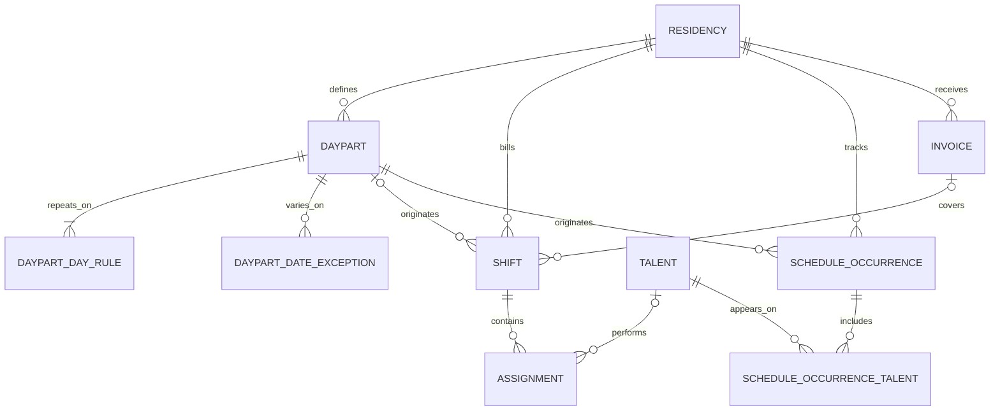

# HFY OS — Residency Build Specification

**Version:** v6  
**Status:** Production as-built specification  
**Effective date:** August 31, 2026  
**Production application:** https://hfy.app  
**Production baseline:** `bd4442b`  
**Supersedes:** v5

> **Changed this revision (v5 → v6):** Rewritten to describe the production platform as it exists now. This revision replaces the previous Residency model and workflow descriptions with the implemented Daypart-type and billing-mode model; nonfinancial schedule occurrences; single-date skip/custom-hours exceptions; the unified real-client/View As route tree; the client-safe Residency workspace; scoped public calendar links; the isolated staging environment and promotion process; and the current connection-pooling, `pdx1`, and serverless bundle-isolation configuration.

## 1. Purpose and system boundary

This document is the current as-built specification for the HFY OS Residency scheduling system. It describes the behavior deployed in production at the baseline revision above.

HFY OS has two distinct authenticated workspaces:

- The **company/owner workspace** is the internal operating system. It contains company-wide Operations and Pipeline views, full Artist Lookup, financial Payouts and Invoices, Residency setup, internal rates, payment data, and administrative controls.
- The **Residency workspace** is the client-scoped experience. It is limited to one permitted Residency and exposes only the calendar, standing Dayparts, a client-safe Talent Roster, payment status without amounts, approved/sent client Invoices, and basic Residency settings.

The public calendar is a third, unauthenticated surface. It is read-only and has a smaller field contract than either authenticated workspace.

## 2. Core Residency scheduling model

### 2.1 Relationship overview



The central distinction is between a **standing schedule definition** and a **saved dated record**:

- A Daypart and its weekday rules define what should normally appear on the calendar.
- A Billed-by-HFY booking materializes as a Shift with Assignments.
- A House Activity or Tracking-only booking materializes as a nonfinancial Schedule Occurrence, with optional registered talent links.

Projected Daypart slots are calculated calendar suggestions. They are not database Shifts and do not create money records until a user schedules them.

### 2.2 Residency

A Residency is one operating program for one client account. It owns:

- identity and location: name, slug, city/state, timezone;
- operating state: Operations/Pipeline mode, active status, and service tier;
- primary contact information;
- default talent and client billing rates;
- Invoice cadence, payment terms, billing contact, Invoice prefix, line presentation, default note, and delivery behavior;
- internal operating notes; and
- all Dayparts, dated schedule records, Invoices, client contacts, and access memberships for that program.

The Residency timezone is authoritative when local Daypart hours are converted to stored timestamps and when public/client calendar times are displayed.

### 2.3 Daypart

A Daypart is a Residency-scoped recurring schedule template. It stores:

- name and room/space;
- calendar color;
- type: `dj_artist` or `house_activity`;
- billing mode when the type is DJ/Artist;
- an optional default talent rate only when the Daypart is Billed by HFY;
- active status, optional active-through date, and sort order; and
- one or more weekday rules.

A Daypart name is unique within its Residency. A Daypart with existing dated history is archived by setting it inactive rather than deleting its historical records. An unused Daypart can be deleted.

Each weekday rule stores a weekday, start minute, end minute, and optional DJ-count planning hint. Rules support overnight windows by allowing the end time to fall on the following local day. The DJ count does not determine slot coverage or limit how many performers can be scheduled; calendar completion is based on actual time coverage.

### 2.4 Projected slot

The calendar projects active Dayparts across the requested date range from their weekday rules. Projection:

- respects the Residency timezone and the Daypart's active-through date;
- applies any single-date exception;
- omits a slot when a Shift or Schedule Occurrence already exists for that Daypart/date; and
- marks coverage as needs scheduling, partially scheduled, or scheduled from the actual registered-talent time windows.

Projection is bounded to a maximum 400-day range per request.

### 2.5 Shift

A Shift is the dated, billable service record created for a Billed-by-HFY DJ/Artist slot. It snapshots the service facts used operationally and financially:

- Residency and optional source Daypart;
- service date, name, room, calendar color, start/end timestamps, and notes;
- client rate and any internal override;
- billing status;
- optional covering Invoice; and
- an explicit Invoice-link issue flag/note when exactly one covering non-void Invoice period cannot be identified.

The application archives a Daypart instead of deleting it when dated history exists. At the schema layer, the Shift's Daypart foreign key is nullable and uses `ON DELETE SET NULL` as a backstop, while the Shift retains its own name, room, date, color, and time snapshots. Shift deletion remains independently available even when its parent Daypart is inactive or absent, and is blocked only when deleting it would violate protected Invoice or payout history.

### 2.6 Assignment

An Assignment is one talent work window inside a financial Shift. It stores:

- the required parent Shift and optional registered Talent record;
- set/guest label and role;
- the Assignment's own start/end timestamps, which must remain inside the Shift window;
- booking status;
- compensation type, immutable resolved rate or fixed fee, and total compensation;
- payout status, paid time, paid amount, and payment reference; and
- internal notes and audit attribution.

The database enforces a valid Shift parent and valid time boundaries. Application logic prevents overlapping active bookings for the same registered artist and overlapping performer windows within one Shift.

Assignments are financial records. Nonfinancial talent participation is deliberately represented by `schedule_occurrence_talent`, not by an Assignment with zeroed money fields.

### 2.7 Schedule Occurrence

A Schedule Occurrence is the dated record for a House Activity or Tracking-only DJ/Artist Daypart. It stores:

- Residency and source Daypart;
- service date, name, room, color, and Daypart type;
- start/end timestamps;
- notes, program/activity details, and a manually typed host/guest name; and
- optional links to registered talent with individual time windows.

A Schedule Occurrence creates no Shift, Assignment, payout, Invoice line, or Invoice. A typed host or program name remains informational and is never promoted into Artist Lookup. When registered talent is selected, the separate talent link supplies booking-history/calendar association without creating financial records.

## 3. Daypart types and billing behavior

Type is the first decision in the Daypart editor. The database constraint and server validation enforce the valid combinations below.

| Daypart type | Billing choice | Calendar action | Saved dated record | Talent association | Financial effect |
| --- | --- | --- | --- | --- | --- |
| DJ / Artist | Billed by HFY | Add/select DJ | Shift plus Assignment(s) | Registered talent from the permitted roster | Client billing and talent payout data are created from snapshotted rates |
| DJ / Artist | Tracking only | Add/select DJ | Schedule Occurrence | Optional registered talent link | No Shift, Assignment, payout, or Invoice record is created |
| House Activity | Not applicable | Mark scheduled | Schedule Occurrence | Optional registered talent link, manual host, or neither | No rate field and no Shift, Assignment, payout, or Invoice record exists |

### 3.1 DJ / Artist — Billed by HFY

This is the complete financial scheduling path. The user selects registered talent from the Residency's client-safe roster and can schedule one or more nonoverlapping performer windows inside the overall Daypart window.

The server resolves talent compensation from the Assignment override, Daypart default, or Residency default and copies the resolved value onto the Assignment. The client rate is similarly snapshotted onto the Shift. The Shift links to the single covering non-void Invoice when one exists; otherwise it is saved with an Invoice-link issue for internal reconciliation.

Residency clients can choose this billing mode and assign talent, but cannot see or submit talent rates, client rates, compensation choices, fixed fees, margins, or rate overrides. Client-originated saves use the protected server path, which removes those fields and applies the internal defaults.

### 3.2 DJ / Artist — Tracking only

Tracking only retains the artist and scheduled time in calendar and booking-history data without creating any financial object. No rate control appears for this mode. The dated record is a Schedule Occurrence, and any registered artist is attached through `schedule_occurrence_talent`.

### 3.3 House Activity

House Activity is for scheduled programming that is not processed as an HFY talent billing event. It has no billing toggle, DJ-count requirement, or rate field. The scheduling form supports:

- program/activity details, such as a movie title or event theme;
- an optional manually typed host/guest name;
- optional registered talent when the activity should appear in that artist's booking history; or
- no person at all.

The UI states that manually typed names are informational. They do not create Talent, Assignment, Payout, or Invoice records.

## 4. Single-date Daypart exceptions

Each Daypart can have one exception per service date. Exceptions change one projected occurrence without changing the standing weekly rule.

### 4.1 Skip

A skip exception suppresses that Daypart on one date. It stores `kind = skip` with no replacement hours. Future calendar projection omits only that Daypart/date pair.

If a dated record already exists, the service checks whether it can be removed safely. An unprotected Shift and its Assignments/line reference, or a nonfinancial Schedule Occurrence, can be removed as part of the skip. Approved Invoice state, payable/paid work, or other protected history is not silently rewritten.

### 4.2 Custom hours

A custom-hours exception stores `kind = override` with a replacement local start/end window. Projection uses those hours for that date only; the normal weekday hours continue before and after it. Custom hours must form a valid window and can cross midnight.

A custom-hours exception is not applied over an already materialized Shift or Schedule Occurrence. The saved dated record must remain authoritative until it is safely removed or edited through its own workflow.

### 4.3 Return to standing hours

Clearing the exception deletes the dated override/skip row. The next projection uses the normal weekday rule again. Creating, changing, clearing, and skipping exceptions is audit logged.

## 5. Authentication, Residency membership, and data isolation

Supabase Auth supplies the authenticated user. HFY OS then resolves the user to one of two application actors:

- an internal owner/admin actor; or
- a Residency actor carrying a specific Residency ID and the `manager` or `calendar_viewer` access role.

Normal customer accounts are constrained to one active Residency membership. Flagged internal test accounts can hold multiple memberships and receive a test-only Residency switcher. The internal-test flag and switcher are not exposed to normal customers, and flagged test contacts are excluded from client-facing access/contact lists.

The client security boundary is enforced in three layers:

1. **Server actor scope:** page loaders and actions take the Residency ID from the authenticated actor or verify a submitted Residency ID against that actor. Manager-only changes require the manager role.
2. **Client-safe projections:** Talent, Invoice, Payment Status, Daypart, and public-calendar queries select or project only fields approved for that surface.
3. **Supabase Data API/RLS:** authenticated read policies are membership-scoped. Grants expose only named client-safe columns. Sensitive payment/document/Invoice-internal tables receive no client read grant, and browser-side mutations are not granted; application mutations remain server-side.

RLS covers Residencies, Dayparts and weekday/date rules, Shifts, Assignments, Schedule Occurrences, occurrence talent, and the client-safe Talent visibility rule. The Talent policy permits active, nonarchived shared talent plus talent exclusive to one of the user's permitted Residencies.

## 6. View As preview mode

View As is an owner-only preview of the real Residency-member experience. It is not a separate mock page, alternate component set, authentication role, or hotel account.

When the owner selects a Residency:

1. HFY OS stores the selected active Operations Residency in an HTTP-only, same-site, secure production cookie with an eight-hour maximum age.
2. The owner is redirected to `/residency/calendar`.
3. Authentication resolves the owner as a Residency manager actor for the selected Residency.
4. The real `/residency` layout renders the shared `ResidencyShell` and the same Residency pages, data loaders, calendar, Day Parts panel, client-safe projections, and server actions used by a real manager login.

There is no preview-specific copy of the client workspace. Automated safety tests assert that View As enters the `/residency` route tree, that all client pages call the same Residency actor resolver, and that client pages do not branch on preview state.

The only preview-specific presentation is an unmissable persistent banner identifying the selected Residency and providing **Exit preview**. Because View As uses the client route tree, company-wide and sensitive financial controls remain absent exactly as they are for a real client login.

View As proves interface and client-data-path parity. It does not replace a real hotel-user account when testing Supabase authentication, membership lookup, RLS behavior, or the external user's actual session.

## 7. Client-scoped Residency experience

The manager workspace navigation is **Overview, Calendar, Day Parts, Talent Roster, Payment Status, Invoices, and Settings**. Day Parts is a separate, equally weighted navigation control that opens the shared Day Parts manager. A `calendar_viewer` account receives read-only Calendar access only.

### 7.1 Client boundary by surface

| Surface | Client-visible data and actions | Data deliberately absent |
| --- | --- | --- |
| Overview | Residency name, count of upcoming Shift records, next Shift service date, calendar link | Other Residencies, company totals, Pipeline, financial summaries, attention queues |
| Calendar | Projected and saved slots, Daypart names/colors/rooms, date/time, scheduling state, client-safe talent selection, notes appropriate to the booking, single-date exceptions, share-calendar control | Talent/client rates, compensation, payouts, margins, Invoice internals, ACH/payment data, W-9 data, internal Residency notes |
| Day Parts | Create/edit/archive standing Dayparts; type, billing choice, name, room, color, active-through date, weekdays, hours, and optional DJ-count planning hint | Daypart and Residency talent rates, client rates, margins, internal billing overrides |
| Talent Roster | Stage name, standardized genres, home market, Instagram handle; active shared talent plus the Residency's own exclusive talent | Full/legal name, email, phone, priority, internal notes, roster review state, outstanding owed, earnings, booking financials, W-9 state/file, payment method, Zelle, routing/account numbers, ACH profile |
| Payment Status | DJ name, scheduled date, scheduled hours, Paid/Pending status, paid date | Payout amount, talent rate, client rate, payment method/reference, bank details, margin |
| Invoices | Approved/Sent Invoices for the current Residency; Invoice number/date/period, amount billed, status, authenticated PDF download | Draft, paid, void, or other-Residency Invoices; internal talent cost, gross margin, margin percentage, payout details; unrestricted Storage paths |
| Settings | Editable Residency name, city/state, timezone, and primary contact name/phone/email | Rates, Invoice setup, internal notes, service tier, company administration, user provisioning and permission management |

The client Invoices query and PDF route independently require the actor's Residency ID and an Approved or Sent status. The PDF download is served privately through the application and is never a raw public Storage URL.

### 7.2 Client-safe talent selection

The Talent Roster page and the calendar's DJ selector use the same client-safe source. Eligible records are:

- active and not archived; and
- either shared/non-exclusive or exclusive to the current Residency.

Talent exclusive to another Residency is excluded. The picker carries only ID, stage name, home market, genres, and Instagram handle; financial and contact data are not fetched into the client component.

### 7.3 Manager actions

A Residency manager can:

- create, edit, archive, or remove Dayparts;
- create and clear single-date skip/custom-hours exceptions;
- schedule House Activities and DJ/Artist slots;
- select permitted registered talent and set talent time windows;
- add talent to an existing eligible Shift;
- create or regenerate a scoped public calendar link; and
- edit the basic Settings fields.

Every manager action rechecks the authenticated Residency boundary on the server. Client-submitted financial overrides are ignored and replaced with protected defaults.

## 8. Public calendar share links

Each Residency can have one active public calendar credential. Managers and the owner can create it from the Residency calendar and choose:

- **Include all Dayparts**; or
- **Select Dayparts**, backed by a stored Daypart allow-list.

The URL form is:

```text
https://hfy.app/share/calendar/{token}
```

### 8.1 Credential lifecycle

- The token contains 256 bits of cryptographic randomness and is encoded as a 43-character base64url value.
- HFY OS stores only its SHA-256 hash, never the plaintext token.
- The token has no automatic expiry.
- Creating/regenerating the link replaces the one stored hash for that Residency, immediately invalidating the old URL.
- The plaintext URL is returned only at creation/regeneration time. If it is lost, it cannot be recovered and must be regenerated.
- Rotation and scope are audit logged.

### 8.2 Public response contract

The unauthenticated response contains exactly:

- DJ Instagram handle;
- service date;
- local start time; and
- local end time.

It does not contain the Residency name, Daypart name, room, artist/legal name, email, phone, IDs, rates, compensation, billing details, notes, or any internal field. House Activities without registered talent do not create a public talent entry.

The public data layer enforces the boundary twice:

1. the database query selects the four source values needed for public output and applies the Residency/Daypart scope; and
2. a final schema projection discards every non-allow-listed property before the page or JSON response is returned.

Tests deliberately inject private fields into an expanded privileged row and response object and verify that those fields cannot cross either projection boundary. Selected-Daypart scope is also rechecked after the query and fails closed when its allow-list is empty.

Public responses use `no-store` caching and `noindex, nofollow, noarchive` robot directives. Invalid or rotated tokens return not found. The public URL grants read-only calendar output and does not create an HFY OS session.

## 9. Staging environment and production promotion

HFY OS has two isolated deployed environments:

| Environment | Git branch | Stable URL | Supabase | Data policy |
| --- | --- | --- | --- | --- |
| Production | `main` | https://hfy.app | Production project | Real operational/client data |
| Staging | `staging` | https://staging.hfy.app | Separate staging project | Synthetic test data only |

The two environments share the Vercel application project but use branch-scoped environment values. Staging has its own Supabase database, Auth users/callbacks, Storage, application URL, and encryption/delivery-sensitive configuration. Production data is not copied into staging. Production Resend delivery and production Healthchecks are not connected to staging.

### 9.1 Promotion workflow

The deployed workflow is:

1. begin from the current production baseline and develop locally against the staging line;
2. use focused checks during iteration;
3. run the complete typecheck, lint, automated test, and production-build gate for the review candidate;
4. push the `staging` branch, which updates `staging.hfy.app` without changing production;
5. review the real staging deployment and staging data;
6. open or update the pull request from `staging` to `main`;
7. apply any pending database migration to production as an explicit promotion step; and
8. merge into `main`, which triggers the normal automatic production deployment.

A staging push is not a production release. Production changes only when the approved work reaches `main` and its deployment becomes Ready.

### 9.2 Database and service configuration

Migration files are shared in Git, but migration execution is environment-specific. The same migration is applied to staging first and production separately at promotion. Supabase Auth callback URLs, Storage buckets, and other project-level settings are also configured separately in each Supabase project.

## 10. Production performance and infrastructure state

### 10.1 Database connection lifecycle

The server uses one module/global `node-postgres` Pool and one Drizzle client per warm Vercel function instance. It does not create a fresh pool for every data call.

Current pool limits are:

- maximum five concurrent connections per warm instance;
- minimum zero;
- five-second idle timeout;
- ten-second connection timeout;
- thirty-minute connection lifetime; and
- allow process exit while idle.

The pool is registered with Vercel's database-pool lifecycle integration so connections are suspended/resumed with the serverless function lifecycle. Runtime diagnostics classify Supabase direct, Supavisor session, and Supavisor transaction-mode URLs without exposing credentials; normal Drizzle queries do not use named prepared statements, keeping them compatible with transaction pooling.

### 10.2 Function region

Vercel server functions are pinned to `pdx1` in production configuration. The region migration was promoted through its isolated performance branch and is part of the production baseline.

### 10.3 Serverless bundle isolation

Invoice PDF generation requires Playwright and serverless Chromium and therefore remains in the Invoice workflow function group. Unrelated routes are separated from that dependency by explicit function grouping/duration boundaries.

The completed isolation covers:

- authentication callback and account-setup APIs;
- the unauthenticated public calendar API; and
- the authenticated internal Daypart API.

The public calendar and internal Daypart functions each measure approximately 1.62 MB in the deployed production function package, down from the approximately 140 MB Chromium-bundled group. The public route has a 30-second function boundary and returns 404 for invalid tokens. The internal Daypart route has the same lightweight boundary and returns 401 for an unauthenticated request, 403 for a signed-in actor outside the Residency, and 404 only when the permitted Residency is absent.

Chromium remains limited to the Invoice workflow that invokes native PDF rendering. This keeps public calendar and routine auth/Daypart cold starts independent of the browser binary.

### 10.4 Data-fetching shape

Calendar page inputs that are independent—financial Shifts, nonfinancial occurrences, Dayparts, roster, share-link settings, and date exceptions—are fetched concurrently. Public calendar financial and tracking rows are also fetched concurrently. Residency calendar assignment rows and public calendar entries are batched by their parent IDs rather than queried once per item.

Dynamic, user-scoped, and public-token responses use explicit private/no-store behavior where correctness or confidentiality requires it. The application does not cache sensitive client data into a shared cross-user response.

## 11. Production verification contract

The behaviors in this specification are backed by database constraints, server validation, and automated tests that cover:

- valid Daypart type/billing/rate combinations;
- one weekday rule and one exception per Daypart/date;
- projection behavior for skip and custom-hours exceptions;
- Shift/Assignment parentage, time bounds, overlap protection, and historical preservation;
- client-safe Talent and Invoice projections;
- membership-scoped RLS and withheld sensitive Data API grants;
- View As/real-client route and component parity;
- public-calendar token hashing, rotation, Daypart scope, injected-field stripping, and final response allow-listing;
- database pool configuration, transaction rollback, and bounded concurrency; and
- unauthenticated/forbidden status handling on the internal Daypart API.

This v6 document describes the production implementation at revision `bd4442b`; it does not redefine behavior independently of that deployed code and schema.
